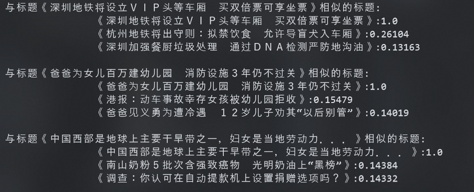

# tfidf-cosine-text-recommendation

# 语料说明

搜狗语料库：http://www.sogou.com/labs/resource/cs.php

# 使用

命令行执行：
```shell
pip install -r requirements.txt -i https://pypi.tuna.tsinghua.edu.cn/simple
python main.py
```

# 效果图


